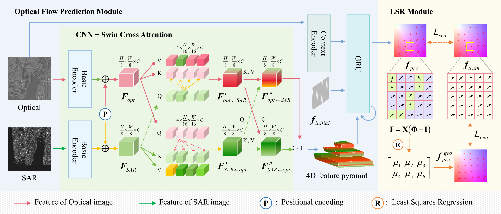

# GDROS
### [Project Page](https://github.com/Zi-Xuan-Sun/GDROS/) 

> GDROS: A Geometry-Guided Dense Registration Framework for Optical-SAR Images under Large Geometric Transformations    
> Zixuan Sun, Shuaifeng Zhi<sup>*</sup>, Ruize Li, Jingyuan Xia, Yongxiang Liu, Weidong Jiang  
> TGRS 2025  





## Data Preparation
To evaluate/train GDROS, you will need to download the required datasets. 
* [WHU-OPT-SAR dataset](https://pan.baidu.com/s/17dNYVhNObbVjgcY2SmlM-w?pwd=ukpw password: ukpw)
* [OS dataset](https://pan.baidu.com/s/1Tn6bkfgXeKQg79rvuUswmg?pwd=7ewa password: 7ewa)


You can create symbolic links to wherever the datasets were downloaded in the `datasets` folder

```Shell
├── datasets
    ├── os_dataset
        ├── training
           ├── opt
           ├── sar_warped
           ├── truth_flow
           ├── datum
        ├── testing
           ├── opt
           ├── sar_warped
           ├── truth_flow
           ├── datum
     ├── whu_opt_sar512
        ├── training
           ├── opt
           ├── sar_warped
           ├── truth_flow
           ├── datum
        ├── testing
           ├── opt
           ├── sar_warped
           ├── truth_flow
           ├── datum

```

## Requirements
```shell
conda create --name gdros python=3.9.7
conda activate gdros
conda install pytorch=2.3.1 torchvision=0.18.1 pytorch-cuda=12.1 matplotlib tensorboard scipy opencv -c pytorch -c nvidia
pip install opencv-python==4.8.0.76
pip install numpy==1.26.4
pip install timm==0.3.2
pip install yacs loguru einops imageio
```

## Training
```shell
python train.py
```

## Models
We provide [models](https://pan.baidu.com/s/1YKbw6FSWjcuJidtAeogjdg?pwd=4ykn password: 4ykn) trained on WHU-OPT-SAR dataset and OS dataset respectively. The default path of the models for evaluation is:
```Shell
├── checkpoints
    ├── GDROS-whu-opt-sar512.pth
    ├── GDROS-os512.pth 
    ├── LSRnet.pth
    ├── raft-sintel.pth
```


## Test
```Shell
python test.py 
```


## Citation
```bibtex

```


